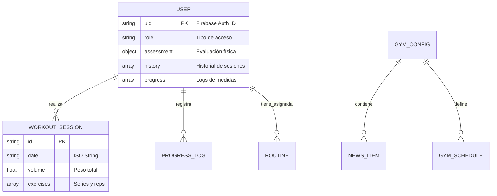

# Documentación de Arquitectura: Sistema Kinetic ⚡

Este documento describe la estructura técnica, flujo de datos y decisiones de diseño detrás de la aplicación Kinetic. Está diseñado para ser escalable, de alto rendimiento y estéticamente disruptivo.

## 1. Stack Tecnológico 🏗️
| Capa | Tecnología | Propósito |
| :--- | :--- | :--- |
| **Framework** | React 18+ (Vite) | UI Reactiva y renderizado ultrarrápido. |
| **Lenguaje** | TypeScript | Seguridad de tipos y autocompletado robusto. |
| **Estilos** | CSS Moderno + Motion | Animaciones de alta fidelidad y diseño "Energetic Brutalism". |
| **Backend** | Firebase | Autenticación, Base de Datos (Firestore) y Almacenamiento. |
| **Utilidades** | Centralized Utils | Manejo de fechas ISO y generación de IDs únicos. |

---

## 2. Estructura de Carpetas 📁
```text
kinetic/
├── src/
│   ├── components/       # Componentes de UI (Vistas y Modales)
│   ├── services/         # Capa de comunicación con Firebase/Nube
│   ├── utils/            # Funciones puras compartidas (Fechas, IDs)
│   ├── types.ts          # LA VERDAD: Todos los esquemas de datos están aquí
│   ├── constants.ts      # El ADNs: Colores, Tipografías y Datos de Catálogo
│   ├── App.tsx           # El Orquestador: Maneja el estado global y navegación
│   └── index.css         # Reset y variables del Sistema de Diseño
├── docs/                 # Documentación técnica (Este archivo)
├── firestore.rules       # Seguridad y acceso a la base de datos
└── vite.config.ts        # Configuración del entorno de desarrollo
```

---

## 3. Arquitectura de Estado y Flujo de Datos 🔄
La aplicación utiliza un flujo **Uni-direccional (Top-Down)**:
1.  **Estado Global (`App.tsx`)**: Gestiona la sesión del usuario, el historial de entrenamientos y la pantalla activa.
2.  **Prop Drilling Controlado**: Los datos bajan desde `App.tsx` hacia los componentes especializados (`Workout`, `History`, `Progress`).
3.  **Capa de Servicios (`db.ts`)**: Los cambios en los componentes (como guardar una rutina) disparan llamadas a servicios que actualizan Firestore y, mediante *Listeners*, sincronizan el estado local automáticamente.

---

## 4. Estrategia de Rendimiento ⚡
*   **Weight Indexing**: Al iniciar una rutina, el sistema pre-indexa el último peso realizado para cada ejercicio, evitando búsquedas lentas en historiales grandes ($O(N)$ vs $O(N \times M)$).
*   **Lazy Modals**: El uso de `AnimatePresence` permite montar y desmontar modales complejos solo cuando son necesarios, liberando memoria del dispositivo.
*   **Standard ISO Storage**: Todas las fechas se guardan como strings ISO para permitir ordenamientos nativos en base de datos sin errores de parsing.

---

## 5. Diseño: Energetic Brutalism 🎨
El diseño no es solo visual, está codificado en `constants.ts` y `index.css`:
*   **Tipografía Headline**: Formas pesadas, cursivas agresivas y tracking tigh.
*   **Paleta de Color**: Fondo Charcoal/Negro con acentos en "Electric Chartreuse" (`--color-secondary-container`).
*   **Micro-interacciones**: Feedback háptico visual (escala 0.98) en cada botón para una sensación táctil de "premium".

---

## 6. Seguridad (RBAC & Relaciones) 🔐
*   **Vínculo Staff-Alumno**: Los socios (`trainee`) pueden ser vinculados a un entrenador específico (`trainerId`). 
*   **Gestión por Entrenador**: Un entrenador solo puede ver y asignar rutinas a sus alumnos asignados, garantizando un flujo de trabajo enfocado.
*   **Control Administrativo**: Los administradores poseen la facultad única de realizar estos vínculos y supervisar toda la actividad global.
*   **Reglas de Firestore Actualizadas**:
    *   `create`: Solo `trainee`.
    *   `update`: El dueño edita su perfil (sin roles); el Entrenador Asignado edita rutinas de su alumno; el Admin edita todo.

---

## 7. Modelo de Datos (Firestore) 📊
La persistencia de datos se gestiona en Google Cloud (Firestore) mediante una estructura NoSQL optimizada:

### 7.1. Diagrama de Relaciones


### 7.2. Detalle de Colecciones
*   **`/users/{uid}`**: Contiene el documento maestro del socio. Incluye arrays de historial y progreso para minimizar lecturas (una sola consulta trae todo el perfil).
*   **`/gym_configs/general`**: Almacena la configuración global compartida por todos los usuarios (horarios y noticias).

> [!IMPORTANT]
> **Nota para Desarrolladores**: Cualquier cambio en la estructura de los datos DEBE reflejarse primero en `src/types.ts` para mantener la consistencia de TypeScript en todo el proyecto.
